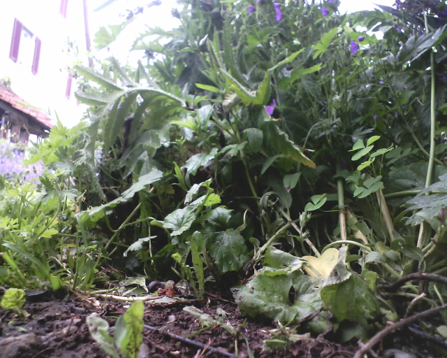

## EspCamSend
  **M5Stack timer camera project to send timed image captures to a raspberry server.
    Perfect for e.g. animal monitoring.**

   
   

### Tags
  M5Stack, timer camera, esp32, arduino, OV3660, imagediv, raspberry, automower, anmimal monitoring

### Description
  The software wakes up the M5Stack camera after a specified time and shoots a smaller black and white image.
  This recording is then analyzed and summarized and then compared with the previous summary.
  If changes are visible in the new image and the brightness does not indicate night, 
  then a high-resolution image is taken and sent to a RaspBerry server.
  The detected image, time and environment data are also sent to the server as an info text file.
  All information on the server will be deleted after a period of time (here e.g. 7 days).
  Since the deep sleep mode of these cameras consumes very little power, the system can send images 
  for over a month with, for example, only hourly recording.
  This is great for e.g. on a robotic lawnmower or a bird box for animal monitoring.

### Disclaimer
   I don't take any responsibility nor liability for using this software nor for the 
   installation or any tips, advice, videos, etc. given by any member of this site or any related site.

### License
   This program is licensed under GPL-3.0

### Source Code
   To compile and install the software on the M5Stack camera you need Arduino and to send the data you need 
   wifi access to a Raspberry server with a web browser installed.
   For more details see the great project from randomnerdtutorials (below).

### Special thanks
   The server part is derived from this great project  
   **ESP32-CAM Post Images to Local or Cloud Server using PHP (Photo Manager)**  
   https://randomnerdtutorials.com/esp32-cam-post-image-photo-server/

### Shopping list

|Label                  |Price      |Sample URL        |
|-----------------------|-----------|------------------|
|M5Stack Timer Camera X |18 CHF     | https://www.bastelgarage.ch/m5stack-esp32-psram-timer-camera-x-ov3660?search=timer camera |
|M5Stack Timer Camera F |20 CHF     | https://www.bastelgarage.ch/m5stack-esp32-psram-timer-camera-f-ov3660?search=timer camera |

